# Sindi
<h1>Anmar SINDI</h1>
It's an application for tailoring and selling Jalalib and accessories to the well-known Saudi Arabia Sindi company 

Backend technology : SAP Business One Service Layer

Screenshots :

  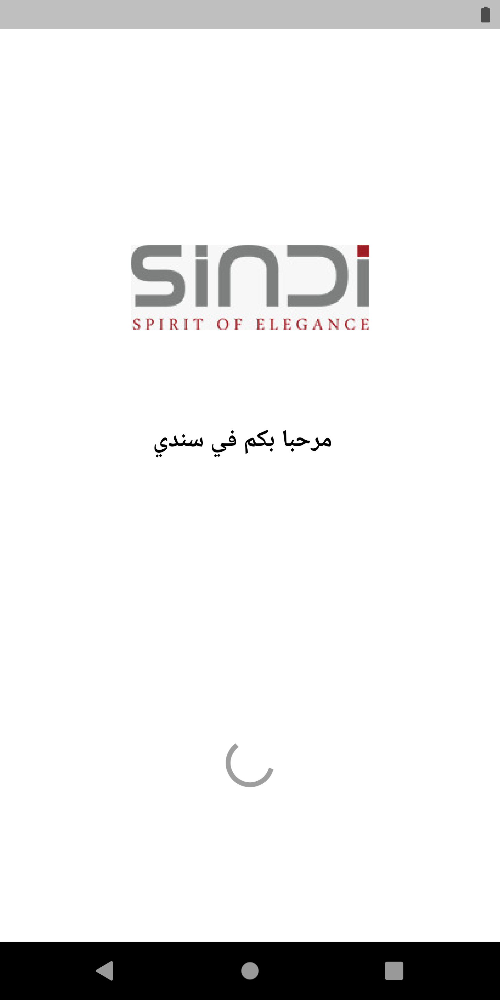
  
  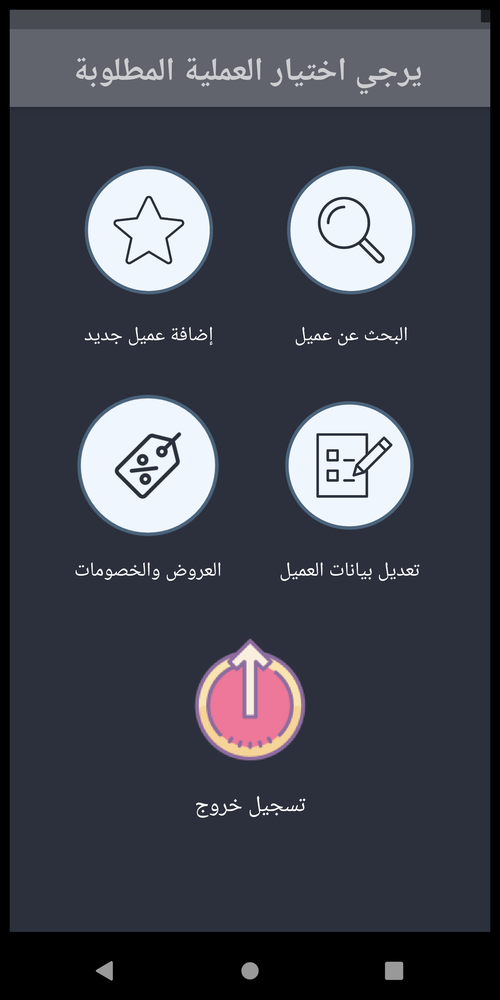
  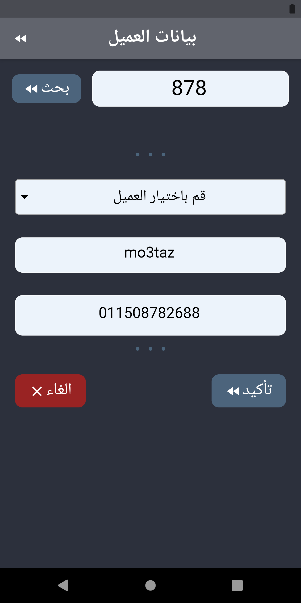
  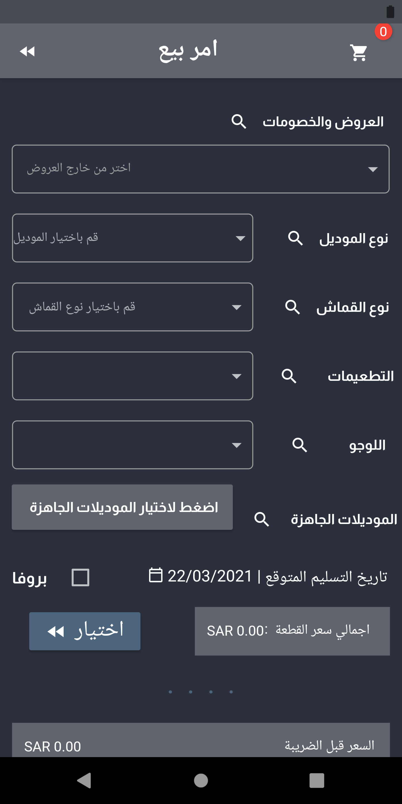
  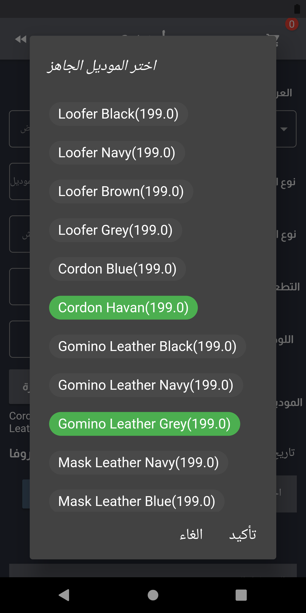
  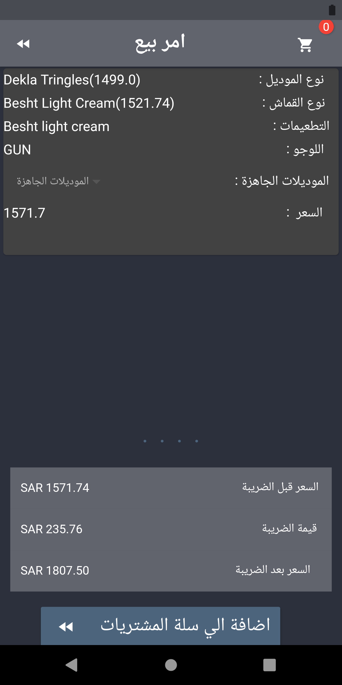
  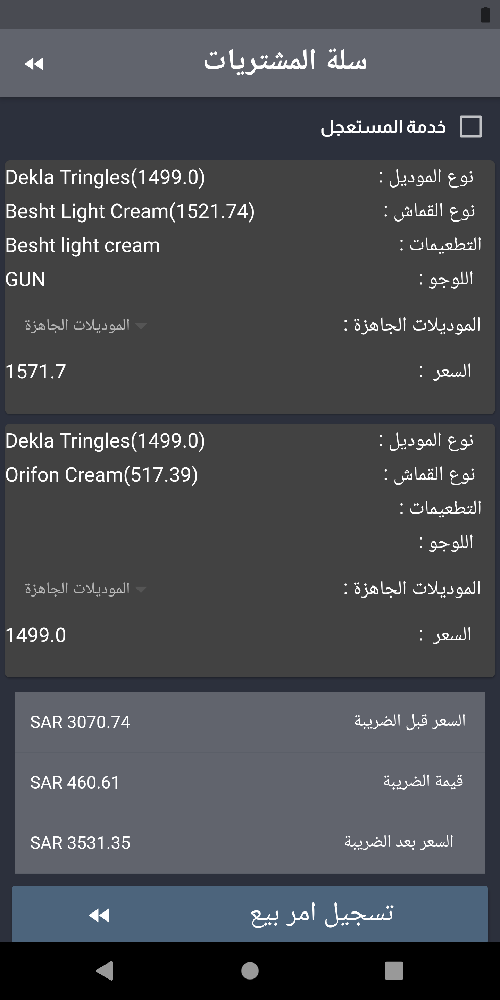
  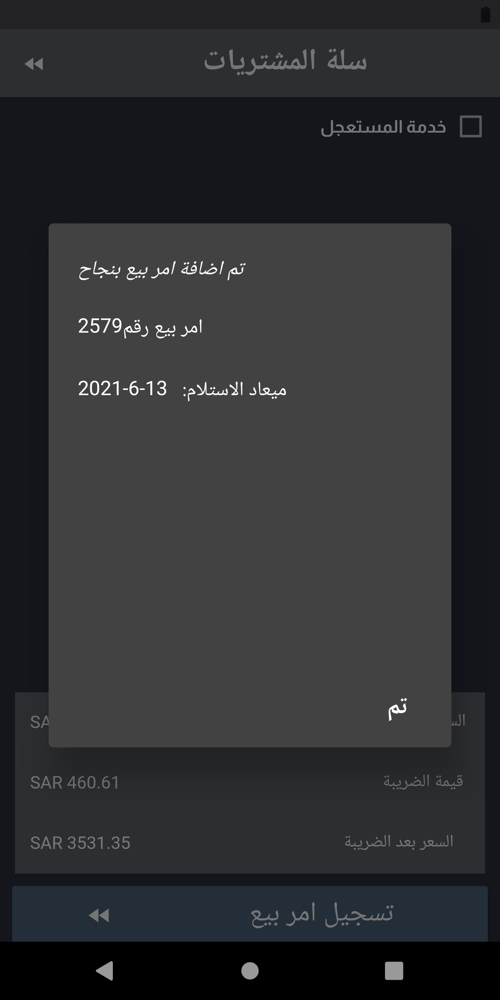
  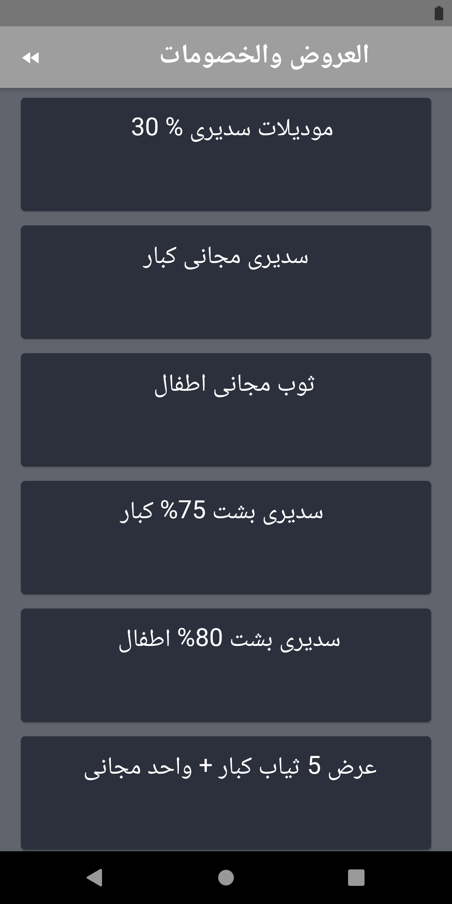
  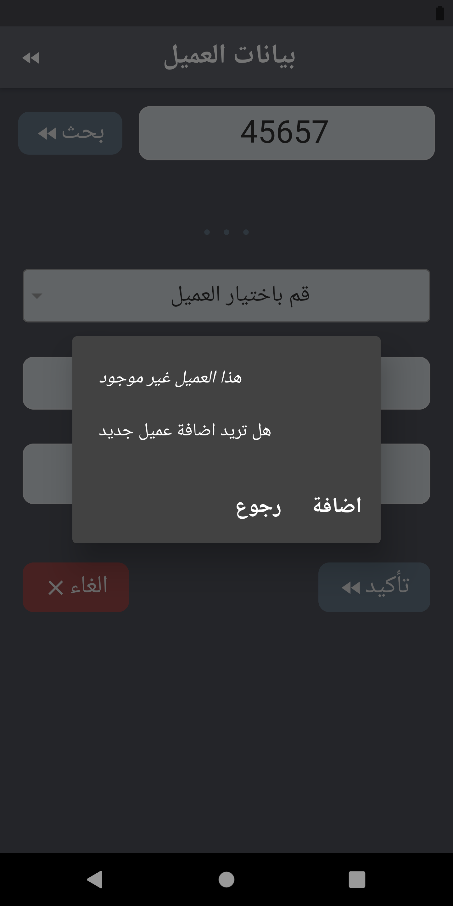
  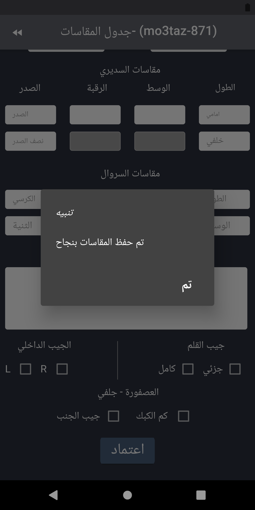
  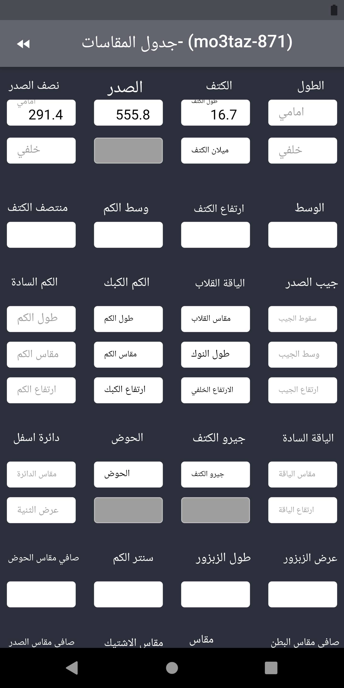
  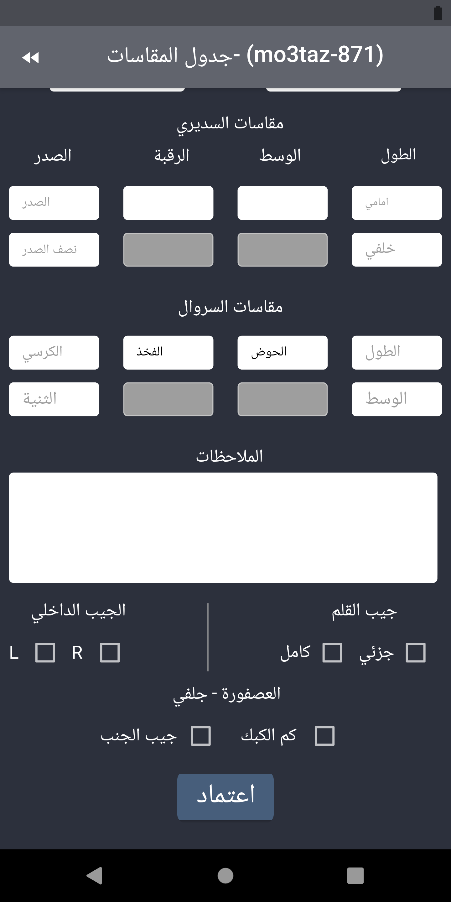
  

Features : 
Customers managment
Sales orders managment
Coupouns & Offers
Customer sizes
Shopping Cart
